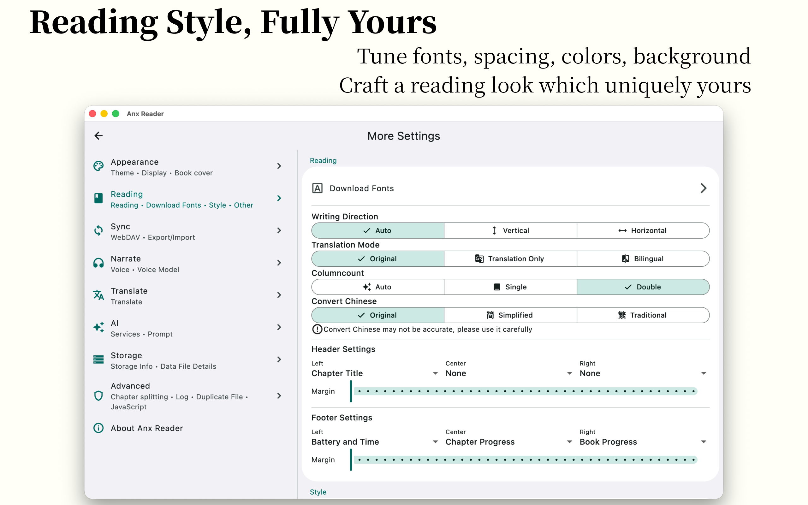
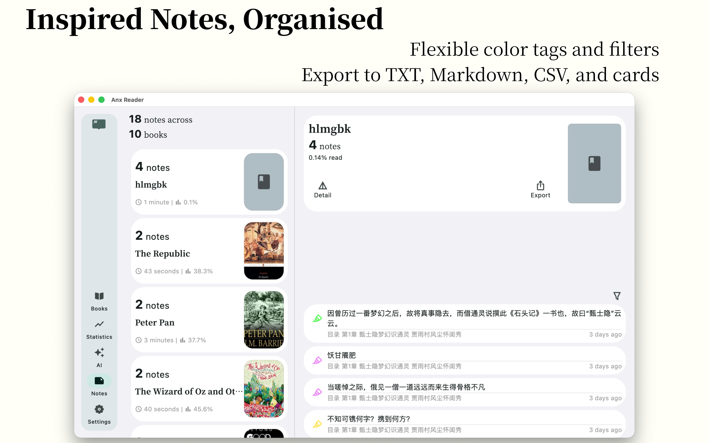
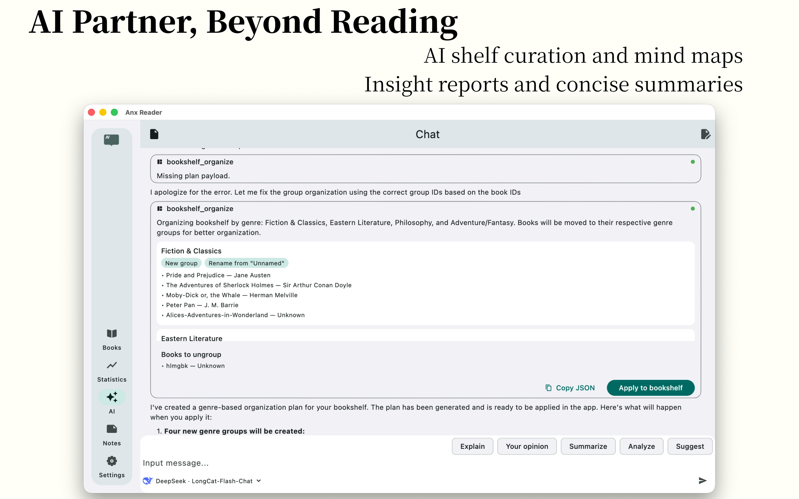
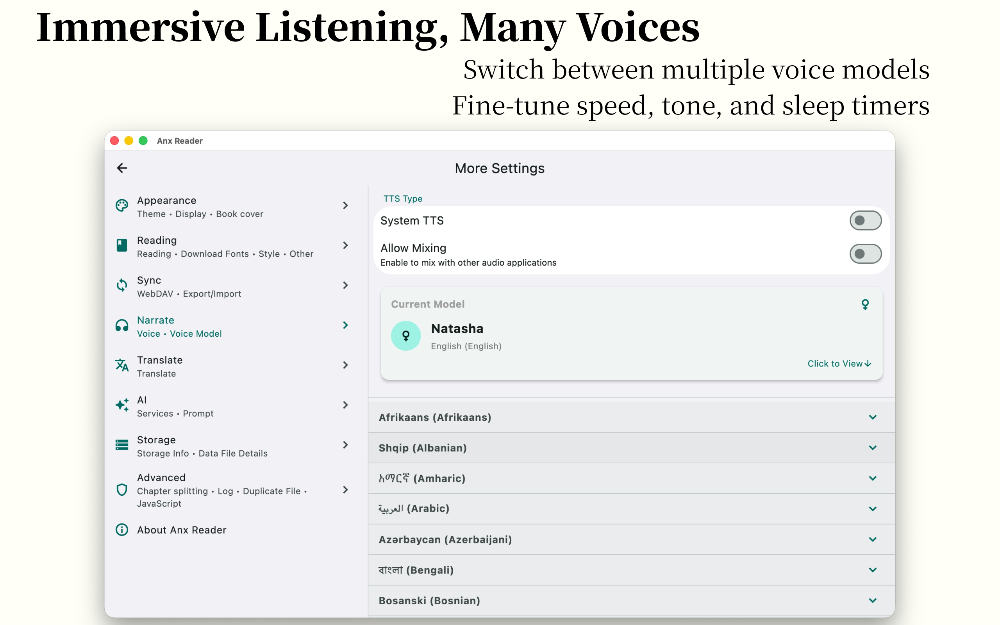
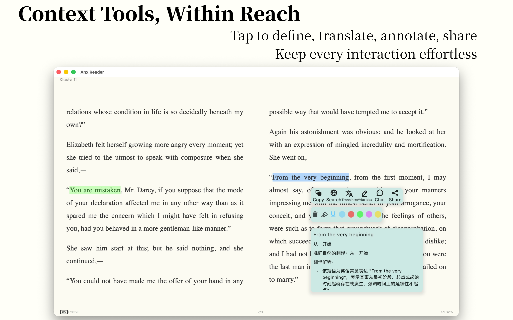
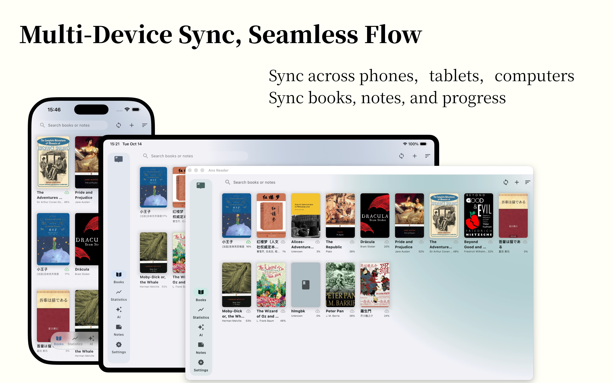
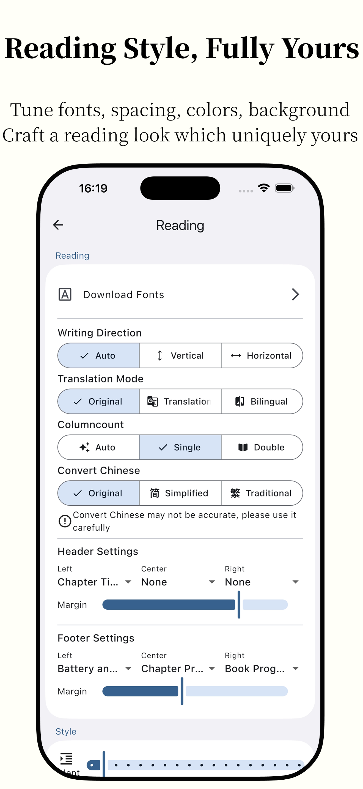
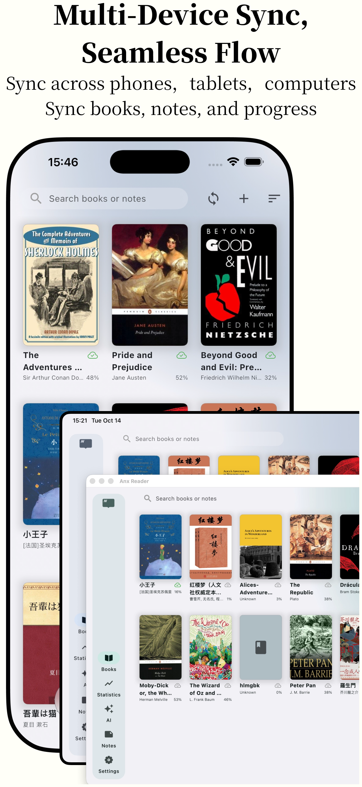

<p align="center">
  
</p>
<h1 align="center">Anx Remix (ANX Reader Fork)</h1>


> [!NOTE]
> **Anx Remix** is a feature-enhanced fork of the excellent open-source e-book reader [ANX Reader](https://github.com/Anxcye/anx-reader), developed by [Anxcye](https://github.com/Anxcye). This fork is distributed under the same permissive MIT License. All original credits, assets, and copyrights belong to their respective creators. For a detailed list of features, fixes, and architectural additions unique to this fork, see the [Anx Remix Features & Improvements Guide](./docs/ANX_REMIX_FEATURES.md).

## Languages / 语言 / Dil / Языки
* [English](#english)
* [简体中文](#简体中文)
* [Türkçe](#türkçe)
* [Русский](#русский)

---

## English

Anx Remix (fork of Anx Reader), a thoughtfully crafted e-book reader for book lovers. Featuring powerful AI capabilities and supporting various e-book formats, it makes reading smarter and more focused. With its modern interface design, we're committed to delivering pure reading pleasure.


### Features
| Feature | Details | Status |
| --- | --- | --- |
| Format Support | EPUB/MOBI/AZW3/FB2/TXT/PDF fully supported | ✅ |
| Cross-Platform Sync | Android/iOS/macOS/Windows coverage<br>Sync books, notes, and reading progress via WebDAV | ✅ |
| AI Assistant | Organizes shelves by progress and tone<br>Generates mind maps for deeper understanding<br>On-demand AI dictionary and translation<br>Delivers perspective analysis and summaries | ✅ |
| Custom Reading Experience | Tune letter, line, paragraph, and margin spacing<br>Adjust font size, style, and weight<br>Customize themes, backgrounds, alignment, and styles | ✅ |
| Notes Workspace | Multiple color/style presets<br>Sort by time or chapter with color filters<br>Export to TXT/Markdown/CSV<br>Create shareable, well-designed cards | ✅ |
| Reading Insights | Track reading time<br>View daily/weekly/monthly/yearly stats<br>Visual heatmap reveals reading habits | ✅ |
| Advanced Extras | TTS with multi-voice, speed, tone, and sleep timer controls<br>Full-book translation with side-by-side view<br>Store books in the cloud and download on demand<br>One-tap simplified/traditional Chinese conversion | ✅ |
| OPDS Catalogs | Built-in OPDS support with custom catalog management | 🛠️ In progress |

### Platform Support
<table border="1">
  <tr>
    <th>OS</th>
    <th>Source</th>
  </tr>
  <tr>
    <td>iOS</td>
    <td>
      <a href="https://apps.apple.com/app/anx-reader/id6743196413" target="_blank">
        
      </a>
    </td>
  </tr>
  <tr>
    <td>macOS</td>
    <td>
      <a href="https://apps.apple.com/app/anx-reader/id6743196413" target="_blank"></a>
      <a href="https://github.com/Anxcye/anx-reader/releases/latest" target="_blank"></a>
    </td>
  </tr>
  <tr>
    <td>Windows</td>
    <td>
      <a href="https://github.com/Anxcye/anx-reader/releases/latest" target="_blank">
        
      </a>
    </td>
  </tr>
  <tr>
    <td>Android</td>
    <td>
      <a href="https://github.com/Anxcye/anx-reader/releases/latest" target="_blank">
        
      </a>
      <a href="https://f-droid.org/packages/com.anxcye.anx_reader" target="_blank">
        
      </a>
    </td>
  </tr>
  <tr>
    <td>Linux</td>
    <td>
      <a href="https://github.com/Anxcye/anx-reader/releases/latest" target="_blank">
        
      </a>
    </td>
  </tr>
</table>

### Running the Linux AppImage
To run the AppImage on Linux, you must install the required shared libraries (GTK3, WebKitGTK, and Secret Service). Depending on your distribution, install the following packages:

* **Debian / Ubuntu / Linux Mint / Pop!_OS**:
  ```bash
  sudo apt install libgtk-3-0 libwebkit2gtk-4.1-0 libsecret-1-0 libblkid1 liblzma5
  ```
* **Fedora**:
  ```bash
  sudo dnf install gtk3 webkit2gtk4.1 libsecret libblkid xz-libs
  ```
* **Arch Linux**:
  ```bash
  sudo pacman -S gtk3 webkit2gtk-4.1 libsecret
  ```

After installing dependencies, make the AppImage executable and run it:
```bash
chmod +x Anx_Remix-x86_64.AppImage
./Anx_Remix-x86_64.AppImage
```

### Community Projects
The following projects are maintained by the community and not officially supported. For issues or feedback related to these projects, please contact the respective project maintainers.

**Calibre Plugin** [anx-reader-calibre-plugin](https://github.com/ptbsare/anx-reader-calibre-plugin)

A Calibre plugin that enables direct management of your ANX Reader ebook library from Calibre. Particularly useful for NAS users looking to centralize their ebook collection.


**Web Library Manager** [anx-calibre-manager](https://github.com/ptbsare/anx-calibre-manager)

A modern web application for managing your ebook library with Calibre integration and WebDAV server functionality for ANX Reader devices.


### I Encountered a Problem, What Should I Do?
Check [Troubleshooting](./docs/troubleshooting.md#English)

Submit an [issue](https://github.com/Anxcye/anx-reader/issues/new/choose), and we will respond as soon as possible.

Telegram Group: [https://t.me/AnxReader](https://t.me/AnxReader)

QQ Group：1042905699

### Screenshots
|  |  |
| :------------------------------: | :----------------------------: |
|      |    |
|      |    |
|      |    |


|  |  |  |
| :----------------------------: | :----------------------------: | :----------------------------: |
|  |  |  |
|  |  |  |

### Self-Hosting Services via Docker
To run local AI tools and container management panels, you should install [Docker](https://docs.docker.com/) and [Docker Compose](https://docs.docker.com/compose/). We provide configuration templates under the [docker/](./docker) folder.

#### 1. Portainer (Container Management)
To deploy Portainer to manage your containers easily:
```bash
cd docker/portainer
docker compose up -d
```
Access the web panel at `http://localhost:9000`.

#### 2. Voicebox (Local AI TTS Server)
To run a local AI text-to-speech engine:
```bash
cd docker/voicebox
docker compose up -d
```
The Voicebox engine is configured to bind to port `17493`. Configure the endpoint in Anx Remix under *Narrator Settings -> Voicebox Server URL* to `http://<your-host-ip>:17493`.

#### 3. Remote/Secure Access via HTTPS & Zero-Trust
If you wish to access your local services (WebDAV, local AI, Portainer) securely over the internet:
* **Zero-Trust VPN**: Use tools like **Tailscale**, **WireGuard**, or **Cloudflare Tunnels** to connect your reading devices directly to your home server without exposing ports to the public internet.
* **Reverse Proxy**: Use a lightweight reverse proxy like **Caddy** or **Nginx Proxy Manager** to configure automatic SSL certificates (HTTPS) and route traffic.
* **Dynamic DNS (DDNS)**: Use free DDNS services like **Duck DNS** or **deSEC** to keep your public domain pointing to your server IP.

### Building
Want to build Anx Reader from source? Please follow these steps:
- Install [Flutter](https://flutter.dev).
- Clone and enter the project directory.
- Run `flutter pub get`.
- Run `flutter gen-l10n` to generate multi-language files.
- Run `dart run build_runner build --delete-conflicting-outputs` to generate the Riverpod code.
- Run `flutter run` to launch the application.

You may encounter Flutter version incompatibility issues. Please refer to the [Flutter documentation](https://flutter.dev/docs/get-started/install).


### Code signing policy
- Committers and reviewers: [Members team](https://github.com/anxcye/anx-reader/graphs/contributors)
- Approvers: [Owners](https://github.com/anxcye)
- [Privacy Policy](https://anx.anxcye.com/privacy.html)
- [Terms of Service](https://anx.anxcye.com/terms.html)

#### Sponsors
|  | Free code signing on Windows provided by [SignPath.io](https://about.signpath.io/),certficate by [SignPath Foundation](https://signpath.org/) |
|------------------------------------------------------------|-----------------------------------------------------------------------------------------------------------------------------------------------|


### License
This project is licensed under the [MIT License](./LICENSE).

Starting from version 1.1.4, the open source license for the Anx Reader project has been changed from the MIT License to the GNU General Public License version 3 (GPLv3).

After version 1.2.6, the selection and highlight feature has been rewritten, and the open source license has been changed from the GPL-3.0 License to the MIT License. All contributors agree to this change(#116).

### Thanks
[foliate-js](https://github.com/johnfactotum/foliate-js), which is MIT licensed, it used as the ebook renderer. Thanks to the author for providing such a great project.

[foliate](https://github.com/johnfactotum/foliate), which is GPL-3.0 licensed, selection and highlight feature is inspired by this project. But since 1.2.6, the selection and highlight feature has been rewritten.

And many [other open source projects](./pubspec.yaml), thanks to all the authors for their contributions.

---

## 简体中文

Anx Remix（安读的分支版本），专为书友精心打造的电子书阅读器。拥有强大的人工智能功能并支持多种电子书格式，让阅读更智能、更专注。凭借其现代化的界面设计，我们致力于为您提供纯粹的阅读乐趣。


### 功能特点
| 功能 | 详情 | 状态 |
| --- | --- | --- |
| 格式支持 | 完全支持 EPUB/MOBI/AZW3/FB2/TXT/PDF | ✅ |
| 跨平台同步 | 覆盖 Android/iOS/macOS/Windows<br>可通过 WebDAV 同步图书、笔记和阅读进度 | ✅ |
| AI 助手 | 按阅读进度和情感基调整理书架<br>生成思维导图以深化理解<br>即时 AI 词典与翻译<br>提供多角度分析与总结 | ✅ |
| 个性化阅读体验 | 调整字距、行距、段距以及页边距<br>调节字号、字体风格和粗细<br>自定义主题、背景、对齐方式和样式 | ✅ |
| 笔记工作区 | 多种颜色/样式预设<br>按时间或章节排序，带颜色过滤<br>可导出为 TXT/Markdown/CSV<br>创建精美可分享的卡片 | ✅ |
| 阅读洞察 | 追踪阅读时长<br>查看日/周/月/年统计数据<br>通过热力图直观呈现阅读习惯 | ✅ |
| 进阶额外功能 | 包含多声音、速度、音调和睡眠定时控制的 TTS<br>双栏对照整本书翻译<br>将图书存储在云端并按需下载<br>一键简繁体中文转换 | ✅ |
| OPDS 书库 | 内置支持 OPDS 自定义书库管理 | 🛠️ 开发中 |

### 平台支持
<table border="1">
  <tr>
    <th>操作系统</th>
    <th>来源</th>
  </tr>
  <tr>
    <td>iOS</td>
    <td>
      <a href="https://apps.apple.com/app/anx-reader/id6743196413" target="_blank">
        
      </a>
    </td>
  </tr>
  <tr>
    <td>macOS</td>
    <td>
      <a href="https://apps.apple.com/app/anx-reader/id6743196413" target="_blank"></a>
      <a href="https://github.com/Anxcye/anx-reader/releases/latest" target="_blank"></a>
    </td>
  </tr>
  <tr>
    <td>Windows</td>
    <td>
      <a href="https://github.com/Anxcye/anx-reader/releases/latest" target="_blank">
        
      </a>
    </td>
  </tr>
  <tr>
    <td>Android</td>
    <td>
      <a href="https://github.com/Anxcye/anx-reader/releases/latest" target="_blank">
        
      </a>
      <a href="https://f-droid.org/packages/com.anxcye.anx_reader" target="_blank">
        
      </a>
    </td>
  </tr>
  <tr>
    <td>Linux</td>
    <td>
      <a href="https://github.com/Anxcye/anx-reader/releases/latest" target="_blank">
        
      </a>
    </td>
  </tr>
</table>

### 运行 Linux AppImage
要在 Linux 上运行 AppImage，您必须安装所需的系统共享依赖库（GTK3, WebKitGTK 和 Secret Service）。根据您所使用的 Linux 发行版，请运行以下相应的安装命令：

* **Debian / Ubuntu / Linux Mint / Pop!_OS**:
  ```bash
  sudo apt install libgtk-3-0 libwebkit2gtk-4.1-0 libsecret-1-0 libblkid1 liblzma5
  ```
* **Fedora**:
  ```bash
  sudo dnf install gtk3 webkit2gtk4.1 libsecret libblkid xz-libs
  ```
* **Arch Linux**:
  ```bash
  sudo pacman -S gtk3 webkit2gtk-4.1 libsecret
  ```

安装完依赖后，赋予 AppImage 可执行权限并启动运行：
```bash
chmod +x Anx_Remix-x86_64.AppImage
./Anx_Remix-x86_64.AppImage
```

### 社区项目
以下项目由社区维护，不提供官方支持。关于这些项目的任何问题或反馈，请直接联系相关的项目维护者。

**Calibre 插件** [anx-reader-calibre-plugin](https://github.com/ptbsare/anx-reader-calibre-plugin)

一个能够让您直接从 Calibre 管理安读电子书库的插件。这对于想要集中化管理图书的 NAS 用户特别实用。

**网页库管理器** [anx-calibre-manager](https://github.com/ptbsare/anx-calibre-manager)

一个提供 Calibre 整合及安读设备 WebDAV 服务器功能的现代网页图书管理应用。

### 我遇到了问题，怎么办？
查看[故障排除](./docs/troubleshooting.md#简体中文)

提出一个[issue](https://github.com/Anxcye/anx-reader/issues/new/choose)，将会尽快回复。

Telegram 群组：[https://t.me/AnxReader](https://t.me/AnxReader)

QQ群：1042905699

### 截图
|  |  |
| :--------------------------: | :--------------------------: |
|  |  |
|  |  |
|  |  |


|  |  |  |
| :----------------------------: | :----------------------------: | :----------------------------: |
|  |  |  |
|  |  |  |

### 使用 Docker 部署本地托管服务
为了运行本地 AI 语音引擎和容器管理面板，建议您安装 [Docker](https://docs.docker.com/) 和 [Docker Compose](https://docs.docker.com/compose/)。我们在项目根目录下的 [docker/](./docker) 文件夹中提供了配置模板。

#### 1. Portainer (容器管理面板)
部署 Portainer 以轻松管理您的 Docker 容器：
```bash
cd docker/portainer
docker compose up -d
```
通过浏览器访问 `http://localhost:9000` 进入管理后台。

#### 2. Voicebox (本地 AI 语音 TTS 服务)
部署本地 AI 文本转语音 (TTS) 服务：
```bash
cd docker/voicebox
docker compose up -d
```
Voicebox 服务默认绑定在 `17493` 端口。您可以在 Anx Remix App 中的 *朗读设置 -> Voicebox 服务地址* 中配置为 `http://<您的宿主机IP>:17493`。

#### 3. 通过 HTTPS & 零信任 (Zero-Trust) 进行远程安全访问
如果您希望在公网安全地访问您的本地服务（如 WebDAV 存储、本地 AI 或 Portainer 面板）：
* **零信任 VPN (Zero-Trust)**: 推荐使用 **Tailscale**、**WireGuard** 或 **Cloudflare Tunnels** 来将您的阅读设备与家中的服务器直接连接，避免直接在公网暴露端口。
* **反向代理 (Reverse Proxy)**: 使用轻量级的反向代理服务如 **Caddy** 或 **Nginx Proxy Manager** 来为服务配置自动 SSL 证书 (HTTPS) 并转发流量。
* **动态域名解析 (DDNS)**: 使用免费的 DDNS 服务如 **Duck DNS** 或 **deSEC** 来保持您的域名实时指向服务器的动态 IP。

### 构建
希望从源码构建安读？请参考以下步骤：
- 安装 [Flutter](https://flutter.dev)。
- 克隆并进入项目目录。
- 运行 `flutter pub get` 。
- 运行 `flutter gen-l10n` 生成多语言文件。
- 运行 `dart run build_runner build --delete-conflicting-outputs` 生成 Riverpod 代码。
- 运行 `flutter run` 启动应用。

您可能遇到 Flutter 版本不兼容的问题，请参考 [Flutter 文档](https://flutter.dev/docs/get-started/install)。

---

## Türkçe

Anx Reader, kitap severler için özenle hazırlanmış bir e-kitap okuma uygulamasıdır. Güçlü yapay zeka yetenekleri ve geniş format desteğiyle okuma deneyimini daha akıllı ve odaklı hâle getirir. Modern arayüz tasarımıyla, saf okuma keyfini sunmayı hedefliyoruz.


### Özellikler
| Özellik | Detaylar | Durum |
| --- | --- | --- |
| Format Desteği | EPUB/MOBI/AZW3/FB2/TXT/PDF formatları tam destekli | ✅ |
| Platformlar Arası Senkronizasyon | Android/iOS/macOS/Windows desteği<br>Kitapları, notları ve okuma ilerlemesini WebDAV üzerinden senkronize edin | ✅ |
| AI Asistanı | Rafları okuma ilerlemesine ve tona göre düzenler<br>Derin anlayış için zihin haritaları oluşturur<br>İhtiyaca göre AI sözlük ve çeviri sağlar<br>Bakış açısı analizi ve özetler üretir | ✅ |
| Özelleştirilebilir Okuma Deneyimi | Harf, satır, paragraf ve kenar boşluklarını ayarlayın<br>Yazı tipi boyutu, stili ve kalınlığını seçin<br>Temaları, arka planları, hizalamayı ve stilleri özelleştirin | ✅ |
| Not Alanı | Çeşitli renk/stil hazır ayarları<br>Zamana veya bölüme göre sıralama, renge göre filtreleme<br>TXT/Markdown/CSV olarak dışa aktarma<br>Paylaşılabilir, özenle tasarlanmış kartlar oluşturma | ✅ |
| Okuma Analizleri | Okuma süresini takip edin<br>Günlük/haftalık/aylık/yıllık istatistikleri görüntüleyin<br>Okuma alışkanlıklarını gösteren ısı haritası | ✅ |
| Gelişmiş Özellikler | Çok sesli, hız, ton ve uyku zamanlayıcılı TTS<br>Yan yana görünümle tam kitap çevirisi<br>Kitapları bulutta saklayıp gerektiğinde indirin<br>Basitleştirilmiş/Geleneksel Çince arasında tek dokunuşla geçiş | ✅ |
| OPDS Katalogları | Yerleşik OPDS desteği ve özel katalog yönetimi | 🛠️ Çalışılıyor |

### Platform Desteği
<table border="1">
  <tr>
    <th>İşletim Sistemi</th>
    <th>Kaynak</th>
  </tr>
  <tr>
    <td>iOS</td>
    <td>
      <a href="https://apps.apple.com/app/anx-reader/id6743196413" target="_blank">
        
      </a>
    </td>
  </tr>
  <tr>
    <td>macOS</td>
    <td>
      <a href="https://apps.apple.com/app/anx-reader/id6743196413" target="_blank"></a>
      <a href="https://github.com/Anxcye/anx-reader/releases/latest" target="_blank"></a>
    </td>
  </tr>
  <tr>
    <td>Windows</td>
    <td>
      <a href="https://github.com/Anxcye/anx-reader/releases/latest" target="_blank">
        
      </a>
    </td>
  </tr>
  <tr>
    <td>Android</td>
    <td>
      <a href="https://github.com/Anxcye/anx-reader/releases/latest" target="_blank">
        
      </a>
      <a href="https://f-droid.org/packages/com.anxcye.anx_reader" target="_blank">
        
      </a>
    </td>
  </tr>
  <tr>
    <td>Linux</td>
    <td>
      <a href="https://github.com/Anxcye/anx-reader/releases/latest" target="_blank">
        
      </a>
    </td>
  </tr>
</table>

### Linux AppImage Çalıştırma
Linux üzerinde AppImage dosyasını çalıştırmak için gerekli paylaşılan sistem kitaplıklarını (GTK3, WebKitGTK ve Secret Service) yüklemeniz gerekir. Dağıtımınıza bağlı olarak aşağıdaki paketleri kurun:

* **Debian / Ubuntu / Linux Mint / Pop!_OS**:
  ```bash
  sudo apt install libgtk-3-0 libwebkit2gtk-4.1-0 libsecret-1-0 libblkid1 liblzma5
  ```
* **Fedora**:
  ```bash
  sudo dnf install gtk3 webkit2gtk4.1 libsecret libblkid xz-libs
  ```
* **Arch Linux**:
  ```bash
  sudo pacman -S gtk3 webkit2gtk-4.1 libsecret
  ```

Bağımlılıkları yükledikten sonra, AppImage dosyasını yürütülebilir yapın ve çalıştırın:
```bash
chmod +x Anx_Remix-x86_64.AppImage
./Anx_Remix-x86_64.AppImage
```

### Topluluk Projeleri
Aşağıdaki projeler topluluk tarafından geliştirilmekte olup resmi olarak desteklenmemektedir. Bu projelere ilişkin sorunlar veya geri bildirimler için lütfen ilgili proje sahipleriyle iletişime geçin.

**Calibre Eklentisi** [anx-reader-calibre-plugin](https://github.com/ptbsare/anx-reader-calibre-plugin)

Calibre içinden ANX Reader e-kitap kütüphanenizi doğrudan yönetmenizi sağlayan bir eklenti. Özellikle kitaplığını NAS üzerinde merkezileştirmek isteyen kullanıcılar için faydalıdır.

**Web Kütüphane Yöneticisi** [anx-calibre-manager](https://github.com/ptbsare/anx-calibre-manager)

Calibre entegrasyonu ve ANX Reader cihazları için WebDAV sunucu işlevleri sunan modern bir web uygulaması.


### Bir Sorunla Karşılaştım, Ne Yapmalıyım?
- [Sorun Giderme](./docs/troubleshooting.md#English) bölümünü kontrol edin.
- Bir [sorun bildirin](https://github.com/Anxcye/anx-reader/issues/new/choose); en kısa sürede yanıtlayacağız.

Telegram Grubu: [https://t.me/AnxReader](https://t.me/AnxReader)

QQ Grubu: 1042905699

### Ekran Görüntüleri
|  |  |
| :------------------------------: | :----------------------------: |
|      |    |
|      |    |
|      |    |


|  |  |  |
| :----------------------------: | :----------------------------: | :----------------------------: |
|  |  |  |
|  |  |  |

### Derleme
Anx Reader'ı kaynak kodundan derlemek ister misiniz? Lütfen şu adımları izleyin:
- [Flutter](https://flutter.dev) kurun.
- Projeyi klonlayın ve dizine girin.
- `flutter pub get` komutunu çalıştırın.
- Çok dilli dosyaları oluşturmak için `flutter gen-l10n` çalıştırın.
- Riverpod kodunu oluşturmak için `dart run build_runner build --delete-conflicting-outputs` çalıştırın.
- Uygulamayı başlatmak için `flutter run` komutunu çalıştırın.

Flutter sürüm uyumsuzluklarıyla karşılaşabilirsiniz. Detaylar için [Flutter dokümantasyonuna](https://flutter.dev/docs/get-started/install) bakın.


### Kod imzalama politikası
- Katkıda bulunanlar ve gözden geçirenler: [Members ekibi](https://github.com/anxcye/anx-reader/graphs/contributors)
- Onaylayıcılar: [Owners](https://github.com/anxcye)
- [Gizlilik Politikası](https://anx.anxcye.com/privacy.html)
- [Hizmet Şartları](https://anx.anxcye.com/terms.html)

#### Sponsorlar
|  | Windows'ta ücretsiz kod imzalama [SignPath.io](https://about.signpath.io/) tarafından sağlanır, sertifika [SignPath Foundation](https://signpath.org/) tarafından temin edilir |
|------------------------------------------------------------|-----------------------------------------------------------------------------------------------------------------------------------------------|


### Lisans
Bu proje [MIT Lisansı](./LICENSE) ile lisanslanmıştır.

Sürüm 1.1.4'ten itibaren, Anx Reader projesinin açık kaynak lisansı MIT Lisansından GNU Genel Kamu Lisansı sürüm 3 (GPLv3) olarak değiştirilmiştir.

Sürüm 1.2.6'dan sonra seçim ve vurgulama özelliği yeniden yazılmış ve açık kaynak lisansı GPL-3.0 Lisansından MIT Lisansına dönmüştür. Tüm katkıda bulunanlar bu değişikliği kabul etmiştir (#116).

### Teşekkürler
[foliate-js](https://github.com/johnfactotum/foliate-js), MIT lisanslıdır ve e-kitap görüntüleyici olarak kullanılmaktadır. Böylesine harika bir proje sunduğu için yazara teşekkür ederiz.

[foliate](https://github.com/johnfactotum/foliate), GPL-3.0 lisanslıdır; seçim ve vurgulama özelliği bu projeden ilham almıştır. Ancak 1.2.6 sürümünden beri bu özellik yeniden yazılmıştır.

Ve birçok [diğer açık kaynak proje](./pubspec.yaml); katkıda bulunan tüm yazarlara teşekkürler.

---

## Русский

Anx Reader — продуманная читалка электронных книг для любителей чтения. Оснащена мощными возможностями искусственного интеллекта и поддерживает различные форматы электронных книг, делая чтение умнее и сосредоточеннее. Благодаря современному дизайну интерфейса мы стремимся подарить вам чистое удовольствие от чтения.


### Особенности
| Раздел | Описание | Статус |
| --- | --- | --- |
| Поддержка форматов | EPUB/MOBI/AZW3/FB2/TXT/PDF полностью поддерживаются | ✅ |
| Кроссплатформенная синхронизация | Android/iOS/macOS/Windows охват<br>Синхронизация книг, заметок и прогресса через WebDAV | ✅ |
| ИИ-ассистент | Упорядочивает книжные полки по прогрессу и настроению<br>Строит интеллект-карты для глубокого понимания<br>ИИ-словарь и мгновенный перевод<br>Проводит анализ точек зрения и готовит дайджесты | ✅ |
| Настраиваемое чтение | Регулировка межбуквенного, межстрочного, межабзацного интервалов и полей<br>Настройка размера, начертания и насыщенности шрифта<br>Выбор тем, фоновых изображений, выравнивания и пользовательских стилей | ✅ |
| Работа с заметками | Цветовые и стилевые пресеты<br>Сортировка по времени или главе с фильтром по цвету<br>Экспорт в TXT/Markdown/CSV<br>Создание опрятных карточек для обмена | ✅ |
| Аналитика чтения | Отслеживает время чтения<br>Статистика по дням/неделям/месяцам/годам<br>Тепловая карта, показывающая привычки чтения | ✅ |
| Расширенные возможности | TTS с выбором голосов, скоростью, тембром и таймером сна<br>Полный перевод книги с параллельным отображением<br>Хранение книг в облаке с выборочной загрузкой<br>Мгновенное переключение между упрощённым и традиционным китайским | ✅ |
| OPDS-каталоги | Поддержка OPDS и добавление собственных каталогов | 🛠️ В работе |

### Поддержка платформ
<table border="1">
  <tr>
    <th>ОС</th>
    <th>Ссылка</th>
  </tr>
  <tr>
    <td>iOS</td>
    <td>
      <a href="https://apps.apple.com/app/anx-reader/id6743196413" target="_blank">
        
      </a>
    </td>
  </tr>
  <tr>
    <td>macOS</td>
    <td>
      <a href="https://apps.apple.com/app/anx-reader/id6743196413" target="_blank"></a>
      <a href="https://github.com/Anxcye/anx-reader/releases/latest" target="_blank"></a>
    </td>
  </tr>
  <tr>
    <td>Windows</td>
    <td>
      <a href="https://github.com/Anxcye/anx-reader/releases/latest" target="_blank">
        
      </a>
    </td>
  </tr>
  <tr>
    <td>Android</td>
    <td>
      <a href="https://github.com/Anxcye/anx-reader/releases/latest" target="_blank">
        
      </a>
      <a href="https://f-droid.org/packages/com.anxcye.anx_reader" target="_blank">
        
      </a>
    </td>
  </tr>
  <tr>
    <td>Linux</td>
    <td>
      <a href="https://github.com/Anxcye/anx-reader/releases/latest" target="_blank">
        
      </a>
    </td>
  </tr>
</table>

### Запуск Linux AppImage
Для запуска AppImage в Linux необходимо установить требуемые общие системные библиотеки (GTK3, WebKitGTK и Secret Service). В зависимости от вашего дистрибутива, выполните соответствующую команду установки:

* **Debian / Ubuntu / Linux Mint / Pop!_OS**:
  ```bash
  sudo apt install libgtk-3-0 libwebkit2gtk-4.1-0 libsecret-1-0 libblkid1 liblzma5
  ```
* **Fedora**:
  ```bash
  sudo dnf install gtk3 webkit2gtk4.1 libsecret libblkid xz-libs
  ```
* **Arch Linux**:
  ```bash
  sudo pacman -S gtk3 webkit2gtk-4.1 libsecret
  ```

После установки зависимостей сделайте файл AppImage исполняемым и запустите его:
```bash
chmod +x Anx_Remix-x86_64.AppImage
./Anx_Remix-x86_64.AppImage
```

### Возникла проблема? Что делать?  
Проверьте раздел [Устранение неполадок](./docs/troubleshooting.md#English)

Создайте [issue](https://github.com/Anxcye/anx-reader/issues/new/choose), и мы ответим как можно скорее.

Группа в Telegram: [https://t.me/AnxReader](https://t.me/AnxReader)

Группа в QQ: 1042905699

### Скриншоты
|  |  |
| :------------------------------: | :----------------------------: |
|      |    |
|      |    |
|      |    |


|  |  |  |
| :----------------------------: | :----------------------------: | :----------------------------: |
|  |  |  |
|  |  |  |

### Пожертвования  
Если вам нравится Anx Reader, пожалуйста, рассмотрите возможность поддержки проекта пожертвованиями. Ваша помощь поможет поддерживать и развивать проект.

❤️ [Пожертвовать](https://anxcye.com/home/7)

### Сборка  
Хотите собрать Anx Reader из исходников? Пожалуйста, выполните следующие шаги:  
- Установите [Flutter](https://flutter.dev).  
- Клонируйте репозиторий и перейдите в каталог проекта.  
- Выполните `flutter pub get`.  
- Выполните `flutter gen-l10n` для генерации файлов мультиязычности.  
- Выполните `dart run build_runner build --delete-conflicting-outputs` для генерации кода Riverpod.  
- Запустите приложение командой `flutter run`.  

Возможно, вы столкнётесь с проблемами совместимости версий Flutter. Пожалуйста, ознакомьтесь с [документацией Flutter](https://flutter.dev/docs/get-started/install).

### Политика подписания кода  
- Коммитеры и рецензенты: [Команда участников](https://github.com/anxcye/anx-reader/graphs/contributors)  
- Утверждающие: [Владельцы](https://github.com/anxcye)  
- [Политика конфиденциальности](https://anx.anxcye.com/privacy.html)  
- [Условия использования](https://anx.anxcye.com/terms.html)

#### Спонсоры  
|  | Бесплатное подписание кода на Windows предоставлено [SignPath.io](https://about.signpath.io/), сертификат выдан [SignPath Foundation](https://signpath.org/) |
|------------------------------------------------------------|-----------------------------------------------------------------------------------------------------------------------------------------------|

### Лицензия  
Этот проект лицензирован под [MIT License](./LICENSE).

Начиная с версии 1.1.4, лицензия проекта Anx Reader была изменена с MIT License на GNU General Public License версии 3 (GPLv3).

После версии 1.2.6 функция выделения и подсветки была переписана, и лицензия была изменена с GPL-3.0 на MIT License. Все участники согласны с этим изменением (#116).

### Благодарности  
[foliate-js](https://github.com/johnfactotum/foliate-js), лицензированный по MIT, используется в качестве рендерера электронных книг. Спасибо автору за отличный проект.

[foliate](https://github.com/johnfactotum/foliate), лицензированный по GPL-3.0, вдохновил функцию выделения и подсветки. Начиная с версии 1.2.6, эта функция была переписана.

И многим [другим open source проектам](./pubspec.yaml), спасибо всем авторам за их вклад.
