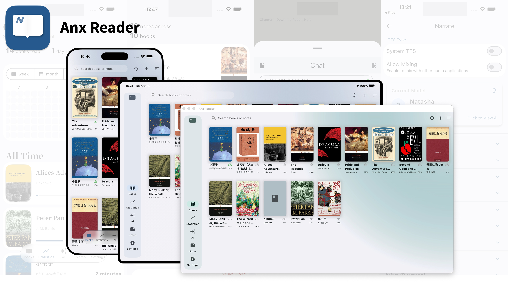
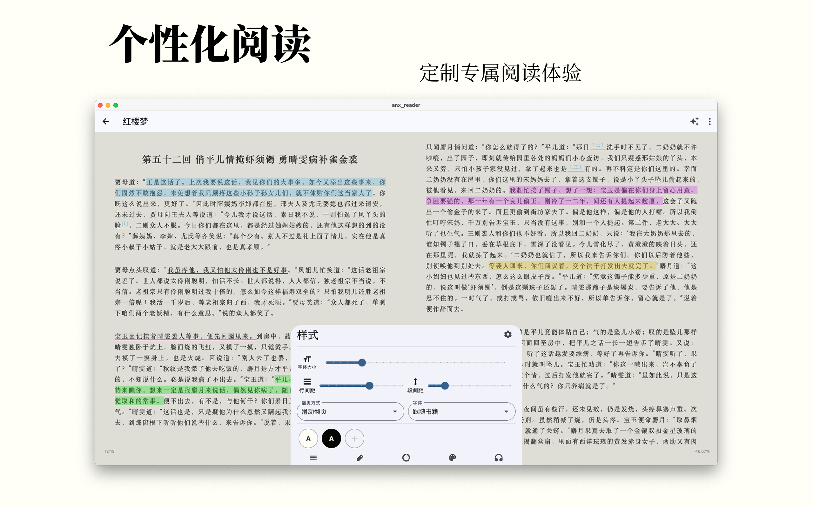
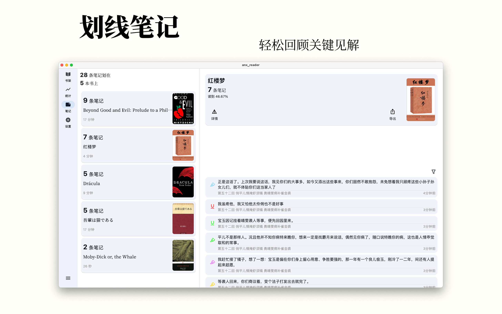
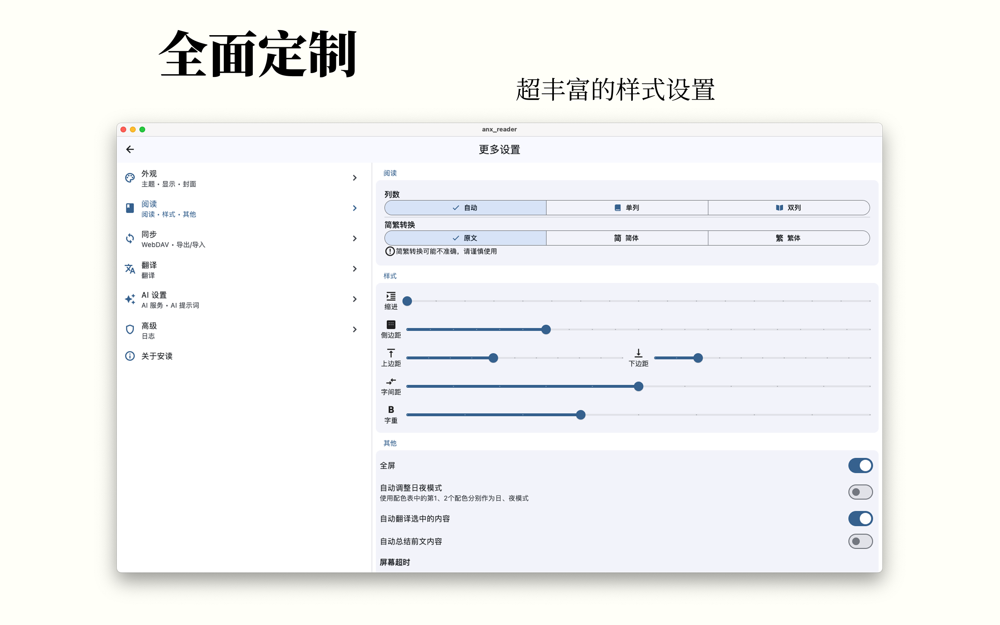
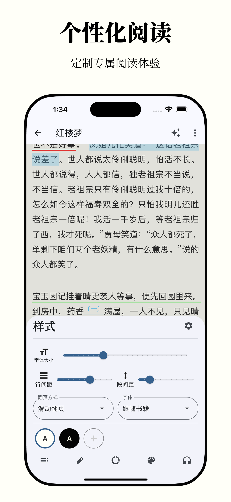
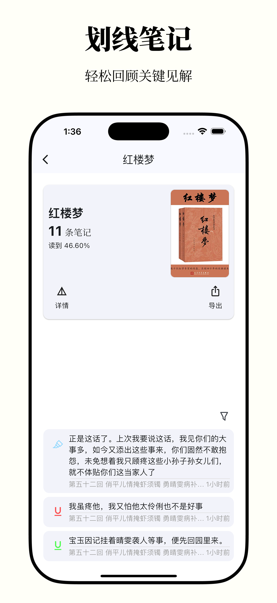
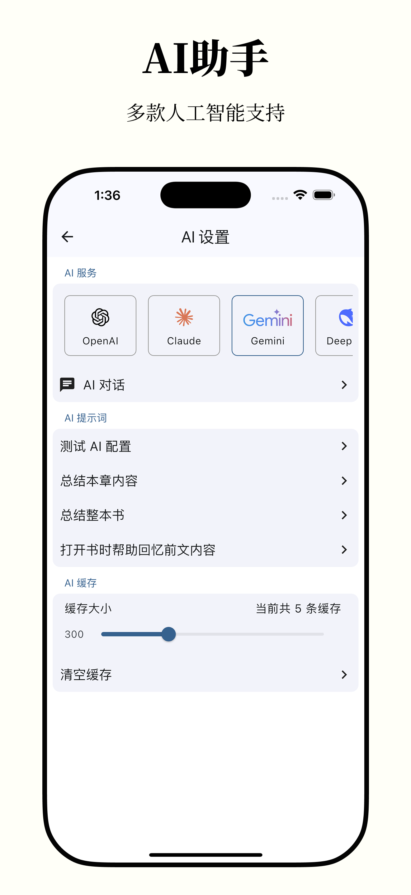
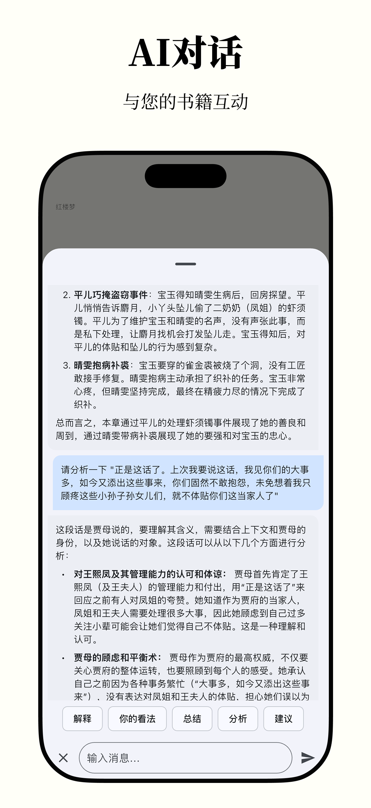
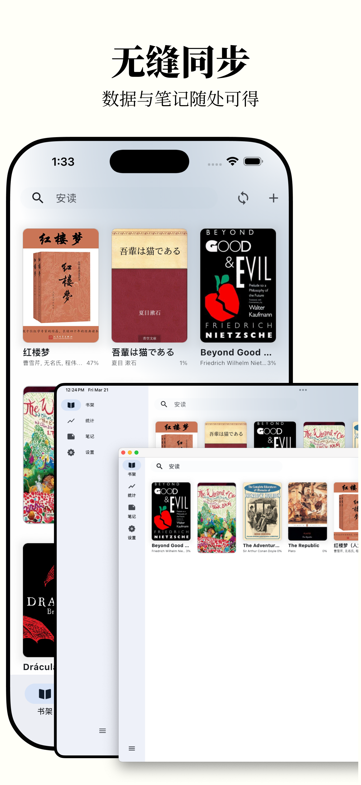

[English](README.md) | **简体中文** | [Türkçe](README_tr.md)

<p align="center">
  
</p>
<h1 align="center">Anx Remix (ANX Reader 分支版)</h1>

<p align="center">
  <a href="https://github.com/Anxcye/anx-reader/blob/main/LICENSE"></a>
  <a href="https://github.com/Anxcye/anx-reader/releases"></a>
  <a href="https://hellogithub.com/repository/819a2b3050204451bed552a8812114e5" target="_blank"></a>
  <a href="https://github.com/anxcye/anx-reader/stargazers"></a>
</p>

> [!NOTE]
> **Anx Remix** 是基于由 [Anxcye](https://github.com/Anxcye) 开发的优秀开源电子书阅读器 [ANX Reader](https://github.com/Anxcye/anx-reader) 的功能增强定制分支版本。本分支版本同样在宽松的 MIT 许可下分发。所有原始学分、资产和版权归其各自的创作者所有。有关本分支特有的功能、修复和架构添加的详细列表，请参阅 [Anx Remix 功能与改进指南](./docs/ANX_REMIX_FEATURES.md)。

Anx Remix（基于 Anx Reader 分支版），一款为热爱阅读的你精心打造的电子书阅读器。集成多种 AI 能力，支持丰富的电子书格式，让阅读更智能、更专注。现代化界面设计，只为提供纯粹的阅读体验。





| 功能模块 | 详细说明 | 状态 |
| --- | --- | --- |
| 多种格式 | EPUB/MOBI/AZW3/FB2/TXT/PDF 已支持 | ✅ |
| 全平台数据同步 | Android/iOS/macOS/Windows 多端覆盖<br>书籍文件、笔记、阅读进度一站式同步 | ✅ |
| AI 助理 | 按阅读进度与风格整理书架<br>生成思维导图辅助理解<br>AI 词典与即时翻译<br>提供观点分析与内容总结 | ✅ |
| 自定义阅读体验 | 调整字间距、段间距、行间距与边距<br>自定义字体大小、样式与字重<br>配置阅读配色、背景图片<br>设置对齐方式与自定义样式 | ✅ |
| 记录笔记 | 多配色与样式选择<br>按时间、章节排序并可按颜色筛选<br>导出 TXT/Markdown/CSV 等多种格式<br>一键生成美观卡片便于分享 | ✅ |
| 阅读统计 | 记录阅读时长<br>按年/月/周/日维度查看<br>阅读热力图呈现习惯变化 | ✅ |
| 其他 | 听书功能：支持多模型、语速、音色与定时<br>书籍全文翻译：原文、译文对照阅读<br>节省空间：云端上传节省本地存储，随用随下<br>简繁转换：中文简繁体一键转换 | ✅ |
| OPDS 书源 | 支持 OPDS 书源，支持自定义添加  |  🛠️  |

<table border="1">
  <tr>
    <th>OS</th>
    <th>Source</th>
  </tr>
  <tr>
    <td>iOS</td>
    <td>
      <a href="https://apps.apple.com/app/anx-reader/id6743196413" target="_blank">
        
      </a>
    </td>
  </tr>
  <tr>
    <td>macOS</td>
    <td>
      <a href="https://apps.apple.com/app/anx-reader/id6743196413" target="_blank">
        
      </a>
      <a href="https://github.com/Anxcye/anx-reader/releases/latest" target="_blank">
        
      </a>
    </td>
  </tr>
  <tr>
    <td>Windows</td>
    <td>
      <a href="https://github.com/Anxcye/anx-reader/releases/latest" target="_blank">
        
      </a>
    </td>
  </tr>
  <tr>
    <td>Android</td>
    <td>
      <a href="https://github.com/Anxcye/anx-reader/releases/latest" target="_blank">
        
      </a>
      <a href="https://f-droid.org/packages/com.anxcye.anx_reader" target="_blank">
        
      </a>
    </td>
  </tr>
  <tr>
    <td>Linux</td>
    <td>
      <a href="https://github.com/Anxcye/anx-reader/releases/latest" target="_blank">
        
      </a>
    </td>
  </tr>
</table>

### 运行 Linux AppImage
要在 Linux 上运行 AppImage，您必须安装所需的系统共享依赖库（GTK3, WebKitGTK 和 Secret Service）。根据您所使用的 Linux 发行版，请运行以下相应的安装命令：

* **Debian / Ubuntu / Linux Mint / Pop!_OS**:
  ```bash
  sudo apt install libgtk-3-0 libwebkit2gtk-4.1-0 libsecret-1-0 libblkid1 liblzma5
  ```
* **Fedora**:
  ```bash
  sudo dnf install gtk3 webkit2gtk4.1 libsecret libblkid xz-libs
  ```
* **Arch Linux**:
  ```bash
  sudo pacman -S gtk3 webkit2gtk-4.1 libsecret
  ```

安装完依赖后，赋予 AppImage 可执行权限并启动运行：
```bash
chmod +x Anx_Remix-x86_64.AppImage
./Anx_Remix-x86_64.AppImage
```


### 我遇到了问题，怎么办？
查看[故障排除](./docs/troubleshooting.md#简体中文)

提出一个[issue](https://github.com/Anxcye/anx-reader/issues/new/choose)，将会尽快回复。

Telegram 群组：[https://t.me/AnxReader](https://t.me/AnxReader)

QQ群：1042905699


### 截图
|  |  |
| :--------------------------: | :--------------------------: |
|  |  |
|  |  |
|  |  |


|  |  |  |
| :----------------------------: | :----------------------------: | :----------------------------: |
|  |  |  |
|  |  |  |

## 使用 Docker 部署本地托管服务
为了运行本地 AI 语音引擎和容器管理面板，建议您安装 [Docker](https://docs.docker.com/) 和 [Docker Compose](https://docs.docker.com/compose/)。我们在项目根目录下的 [docker/](./docker) 文件夹中提供了配置模板。

### 1. Portainer (容器管理面板)
部署 Portainer 以轻松管理您的 Docker 容器：
```bash
cd docker/portainer
docker compose up -d
```
通过浏览器访问 `http://localhost:9000` 进入管理后台。

### 2. Voicebox (本地 AI 语音 TTS 服务)
部署本地 AI 文本转语音 (TTS) 服务：
```bash
cd docker/voicebox
docker compose up -d
```
Voicebox 服务默认绑定在 `17493` 端口。您可以在 Anx Remix App 中的 *朗读设置 -> Voicebox 服务地址* 中配置为 `http://<您的宿主机IP>:17493`。

### 3. 通过 HTTPS & 零信任 (Zero-Trust) 进行远程安全访问
如果您希望在公网安全地访问您的本地服务（如 WebDAV 存储、本地 AI 或 Portainer 面板）：
* **零信任 VPN (Zero-Trust)**: 推荐使用 **Tailscale**、**WireGuard** 或 **Cloudflare Tunnels** 来将您的阅读设备与家中的服务器直接连接，避免直接在公网暴露端口。
* **反向代理 (Reverse Proxy)**: 使用轻量级的反向代理服务如 **Caddy** 或 **Nginx Proxy Manager** 来为服务配置自动 SSL 证书 (HTTPS) 并转发流量。
* **动态域名解析 (DDNS)**: 使用免费的 DDNS 服务如 **Duck DNS** 或 **deSEC** 来保持您的域名实时指向服务器的动态 IP。

## 构建
希望从源码构建安读？请参考以下步骤：
- 安装 [Flutter](https://flutter.dev)。
- 克隆并进入项目目录。
- 运行 `flutter pub get` 。
- 运行 `flutter gen-l10n` 生成多语言文件。
- 运行 `dart run build_runner build --delete-conflicting-outputs` 生成 Riverpod 代码。
- 运行 `flutter run` 启动应用。

您可能遇到 Flutter 版本不兼容的问题，请参考 [Flutter 文档](https://flutter.dev/docs/get-started/install)。
